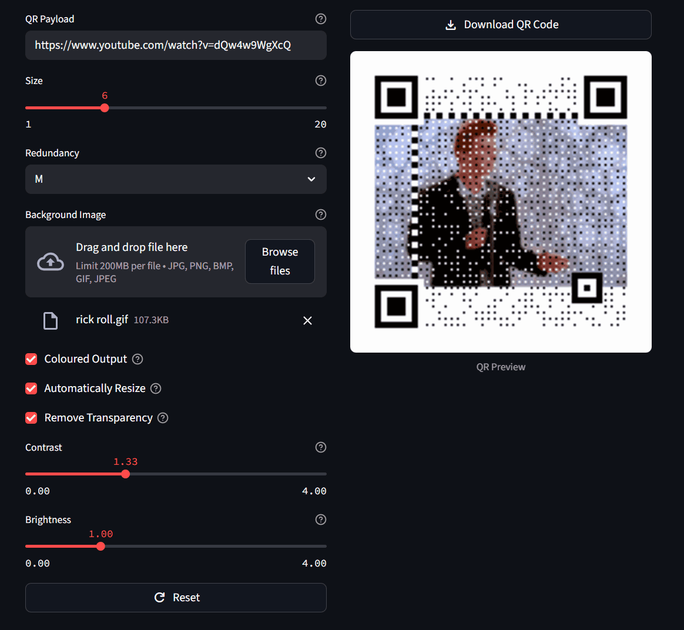

## About

- A simple application to generate QR codes with background images (including animated GIFs!)
- Supports all features in [amazing-qr](https://github.com/x-hw/amazing-qr) and more!
  - Supports looping GIFs and preserves the original framerate
  - Automatically pads the image to maintain its aspect ratio
  - Quick & easy `Remove Transparency` option to hide the default blocky QR codes

## Installation
### Docker
- Ensure that **Docker Desktop** is installed and running
- `git clone` the repository
- Start the application via `docker compose up`
- Access the application at `localhost:8501`
- Stop the application via <kbd>Ctrl + C</kbd>

### Direct-Installation
#### Pre-requisites
The following need to be installed:
- `Python` (>=3.13)
- `uv` (i.e. through `pip install uv`)

#### Setup
- `git clone` the repository
- Within the repository, start the application via `uv run streamlit run main.py`
- Access the application at `localhost:8501`
- Stop the application via <kbd>Ctrl + C</kbd>

## Usage Guide
- Type your payload (i.e. URL/text) in `QR Payload`
- Upload a Background image (.jpeg, .bmp, .png & .gif supported) if desired
- Increase `Size` to a higher value if more resolution is required to preserve image details
- Click on `Download QR Code` to get the resultant QR code

## Known Issues
- For GIF QR code creation, the application errors out due to some race-condition if you change the settings too quickly
  - Updating the settings again should resolve the error
- GIFs with variable framerates are not properly supported
  - A fixed framerate is used across the entire GIF

## TODOs
- [ ] Test image dataset
  - [ ] Unit tests over filter permutations
- [ ] Fix unnecessary rerender when clicking on `Download QR Code` 
- [ ] Fix race condition for long-running GIF renders
- [ ] Docker image

## Credits
- QR Code rendering backend based off [amazing-qr](https://github.com/x-hw/amazing-qr)